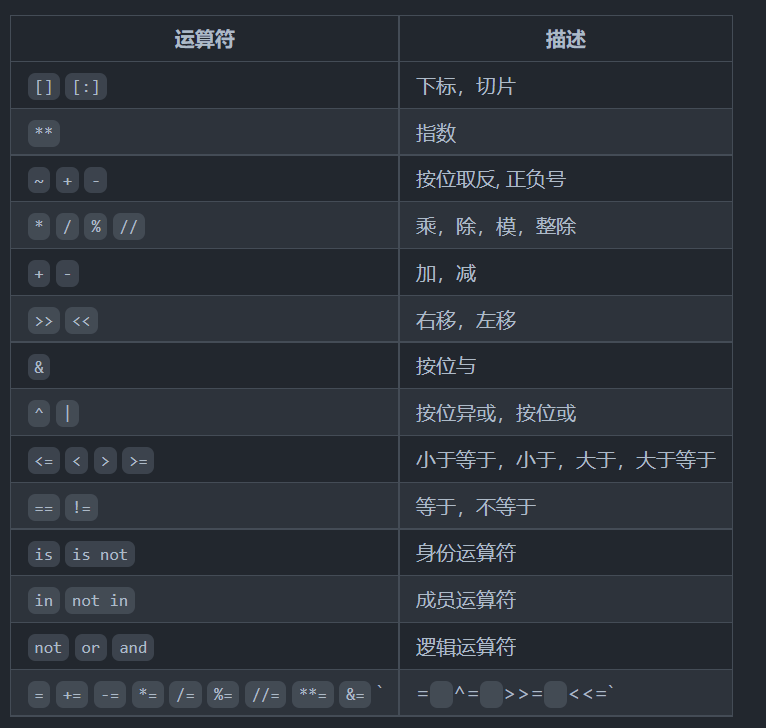

+++
title = '{{ python }}'
date = 2024-03-26T14:55:58+08:00
draft = false
+++

# python基础
单引号和双引号一样

`def` 定义函数
`*arg `可变参数
`from .py import function`
`import .py as name` 起别名
`__name__`是Python中一个隐含的变量它代表了模块的名字  
 只有被Python解释器直接执行的模块的名字才是`__main__` 
如果我们导入的模块除了定义函数之外还有可以执行代码，那么Python解释器在导入这个模块时就会执行这些代码
`global`关键字来指示函数中的变量来自于全局作用域
***The Law of Demeter (LoD) or principle of least knowledge***  
> is a design guideline for developing software, particularly object-oriented programs. In its general form, the LoD is a specific case of loose coupling. The guideline was proposed by Ian Holland at Northeastern University towards the end of 1987, and can be succinctly summarized in each of the following ways:

>1. Each unit should have only limited knowledge about other units: only units "closely" related to the current unit.  
>2. Each unit should only talk to its friends; don't talk to strangers.  
>3. Only talk to your immediate friends.
```
def main():
    # Todo: Add your code here
    pass


if __name__ == '__main__':
    main()
```
从现在开始我们可以将Python代码按照上面的格式进行书写，这一点点的改进其实就是在我们理解了函数和作用域的基础上跨出的巨大的一步。
在\后面还可以跟一个八进制或者十六进制数来表示字符，例如\141和\x61都代表小写字母a
`sys.getsizeof()`相当于C++的sizeof()
`yield` 相当于return(默认为iter类型)

元组（定义方式为（，，）），默认无法修改

集合{}
```
print(f'{a} * {b} = {a * b}')
print('{0} * {1} = {2}'.format(a,b,a*b))
print('%d * %d = %d'%(a,b,a*b))
```
`add()` 添加元素  
`update()`添加元素或集合
```
str1 = 'hello, world!'
# 通过内置函数len计算字符串的长度
print(len(str1)) # 13
# 获得字符串首字母大写的拷贝
print(str1.capitalize()) # Hello, world!
# 获得字符串每个单词首字母大写的拷贝
print(str1.title()) # Hello, World!
# 获得字符串变大写后的拷贝
print(str1.upper()) # HELLO, WORLD!
# 从字符串中查找子串所在位置
print(str1.find('or')) # 8
print(str1.find('shit')) # -1
# 与find类似但找不到子串时会引发异常
# print(str1.index('or'))
# print(str1.index('shit'))
# 检查字符串是否以指定的字符串开头
print(str1.startswith('He')) # False
print(str1.startswith('hel')) # True
# 检查字符串是否以指定的字符串结尾
print(str1.endswith('!')) # True
# 将字符串以指定的宽度居中并在两侧填充指定的字符
print(str1.center(50, '*'))
# 将字符串以指定的宽度靠右放置左侧填充指定的字符
print(str1.rjust(50, ' '))
str2 = 'abc123456'
# 检查字符串是否由数字构成
print(str2.isdigit())  # False
# 检查字符串是否以字母构成
print(str2.isalpha())  # False
# 检查字符串是否以数字和字母构成
print(str2.isalnum())  # True
str3 = '  jackfrued@126.com '
print(str3)
# 获得字符串修剪左右两侧空格之后的拷贝
print(str3.strip())
```
## 函数 lambda表达式

可以单独引入一个py文件中的某个函数

`**kw` 表示接受任意数量的关键字参数（关键字参数是指以键值对形式传入的参数）。

`*`解包运算符

## 输入输出IO


## 语法

With
```
The with statement
The with statement is used to wrap the execution of a block
with methods defined by a context manager (see section With 
Statement Context Managers). This allows common try...
except...finally usage patterns to be encapsulated for
convenient reuse
```


## 数学

[start:stop:step]python的数组全参数

区间中，正数是移，负数是本身

python中的区间大部分是左闭右开，有趣，念作不到(自己想的)

python的整数占内存这么多啊，一个PyObject_VAR_HEAD就24B，常规28B

HARD ~a，a是正负数什么东西啊，这个取反符号看不懂

/是除，//是整除

两种风格输出
```
name="张三"; age=20
print("%s的年龄是%d"%(name,age))   #输出结果：张三的年龄是20
print("{}的年龄是{}".format(name,age))   #输出结果：张三的年龄是20
```

# CONDA
## `miniconda`常用指令
创建一个新的环境：

conda create --name <环境名称>
可以使用 -n 或 --name 参数指定环境名称。可以加上 python=<版本号> 来指定安装的Python版本。

激活一个环境：

conda activate <环境名称>
这将激活指定的环境。激活后，命令行提示符前会显示环境名称。

退出当前环境：

conda deactivate
这将退出当前已激活的环境，返回到系统默认环境。

列出所有已安装环境：

conda env list
这将显示所有已创建的环境及其路径。当前激活的环境会用星号 (*) 标记。

安装包：

conda install <包名称>
这将安装指定的包及其依赖项。可以通过 conda install <包名称>=<版本号> 指定特定的包版本。

升级包：

conda update <包名称>
这将升级指定的包到最新版本。

移除包：

conda remove <包名称>
这将移除指定的包及其依赖项。可以加上 -y 参数来跳过确认提示。

导出环境配置：

conda env export > environment.yml
这将将当前环境的配置导出到 environment.yml 文件中，包括所有已安装的包及其版本。

导入环境配置：

conda env create -f environment.yml
这将根据 environment.yml 文件中的配置创建一个新的环境。

查找可用包：

conda search <包名称>
这将搜索并显示与指定名称匹配的可用包。

显示已安装的包：

conda list
这将显示当前环境下已安装的所有包及其版本信息。

清理不再使用的包和缓存：

清理不再使用的包：
conda clean --packages
这将清理不再被使用的包。
清理缓存：
conda clean --all
这将清理不再被使用的缓存和索引文件，以释放磁盘空间。
移除环境：

conda env remove --name <环境名称>
conda remove -n  <需要删除的环境名> --all
这将移除指定的环境。

复制虚拟环境到另外一台设备：
在Miniconda的安装路径下，找到envs文件夹，该文件夹中包含了所有的虚拟环境。找到你要拷贝的虚拟环境的文件夹，并将该文件夹复制到目标电脑Miniconda的安装路径下的envs文件夹
在目标电脑上打开命令提示符或PowerShell，进入Miniconda的安装路径下的envs文件夹。运行以下命令来激活虚拟环境：

.\envs\your_env_name\Scripts\activate
其中，your_env_name是你想要激活的虚拟环境的名称。

Linux复制虚拟环境方法
在Miniconda的安装路径下，找到envs文件夹，该文件夹中包含了所有的虚拟环境。找到你要拷贝的虚拟环境的文件夹，将其打包成一个压缩文件，例如使用tar命令：

tar -czvf my_env.tar.gz my_env
在目标服务器上Miniconda的envs文件夹下，解压缩文件：

tar -xzf my_env.tar.gz
进入解压后的虚拟环境文件夹

cd my_env
运行以下命令来激活虚拟环境：

source activate my_env

用于人工智能的python版本都不能太高，因为有包依赖的