+++
title = '{{ 需求分析与系统设计 }}'
date = 2024-03-26T14:55:58+08:00
draft = false
+++

目录
* [系统开发过程管理](#sdpm)
* [views](#v)
* [UML](#uml)
  * [starUML](#staruml)
* [Software Requirements](#sr)
* [模型和建模](#model)
* [用例图](#usecase)
* [系统分析-结构化](#sysana)
* [系统分析-对象化](#obor)
* [系统设计-结构化](#sds)
#  [需求分析与系统设计]()  

>[erp]()`Enterprise Resource Planning`  
联合应用设计会议(Joint Application Design, JAD)

列表框，组合框  

---
---
#  [系统开发过程管理]()    
1. **RUP** rational unified process 统一软件开发过程 
2. **RAD** rapid application development 快速软件开发  
3. **MSF** microsoft sync framework 微软解决方案框架
4. **JAD** joint application development 联合应用软件开发
5. **Agile** XP、scrum等  

---  
#  [views]() 
是表达系统某一方面特征的 UML 建模元素的子集，它是由一个或者多个图组成的对系统某个角度的抽象  
1. Usecase View  
&emsp;&emsp;描述系统应该具备的功能，即被称为参与者（执行者）的外部用户所能观察到的功能  
2. Logical View  
&emsp;&emsp;描述`用例视图`中提出的系统功能的实现  
3. Process View  
&emsp;&emsp;考虑资源的有效利用、代码的并行执行以及系统环境中异步事件的处理  
4. Implementation View  
&emsp;&emsp;描述系统的实现模块以及它们之间的依赖关系  
5. Deployment View  
&emsp;&emsp;显示系统的物理部署，并描述位于节点实例上的运行组件实例的部署情况  

---
#  [UML]() 
unified modeling language 对软件系统实现visualizing,specifying,constructing,documenting  
关系： 关联、依赖、泛化、实现、聚合  
+ 用例图 UseCaseDiagram
+ 类图  &ensp;&ensp;ClassDiagram  
&emsp;&emsp;描述类的内部结构和类与类之间的关系  
+ 状态图 StatechartDiagram  
&emsp;&emsp;来描述类的对象所有可能的状态以及时间发生时状态的转移条件  
+ 活动图 ActivityDiagram `是状态图的一种特殊情况`  
&emsp;&emsp;描述了活动到活动的控制流  
+ 时序图 SequenceDiagram  
&emsp;&emsp;描述了对象之间消息发送的先后顺序  
+ 协作图 CollaborationDiagram  
&emsp;&emsp;描述了收发消息的对象的组织关系  
+ 组件图 ComponentDiagram  
&emsp;&emsp;表示系统中组件与组件之间，类或接口与组件之间的关系  
+ 部署图 DeploymentDiagram  
&emsp;&emsp;描述了系统运行时进行处理的结点以及在结点上活动的构件的配置。  

---
#  [StarUML]()  

---
#  [Software Requirements]()  
以一种清晰、简洁、一致且无二义性的方式，描述用户对目标软件系统在功能、行为、性能、设计约束等方面的期望，是在开发过程中对未来系统的约束  
[业务需求Business Requirements]()  客户对于系统的高层次目标要求`high-level objectives` ，定义了项目的远景和范畴`vision and scope`  \
[用户需求(User Requirements)]()  从用户角度描述的系统功能需求与非功能需求，通常只涉及系统的外部行为而不涉及内部特性  
[功能需求Functional Requirements]()  系统应该提供的功能或服务，通常涉及用户或外部系统与该系统之间的交互  
[非功能需求Non-Functional Requirements]()  
&emsp;&emsp;从各个角度对系统的约束和限制,即质量和性能(quality and performance):  
&emsp;&emsp;`安全性、可靠性、互操作性、健壮性、易使用性、可维护性、可移植性、可重用性、可扩充性等`  
[业务规则Business Rule]() 对某些功能的可执行性或内部执行逻辑的一些限定条件  
[数据定义]() 当客户描述一个数据项或一个复杂的业务数据结构的格式、允许值或缺省值时，他们正在进行数据定义。  
[约束条件Constraints]() 系统设计和实现时必须满足的限制条件  
[外部接口需求External Interface Requirement]() 描述系统与其所处的外部环境之间如何进行交互  

[需求获取Requirement Elicitation]() 通过与用户的交流，对现有系统的观察及对任务进行分析，从而开发、捕获和修订用户的需求  
[需求分析Requirement Analysis]() 对收集到的需求进行提炼、分析和审查，为最终用户所看到的系统建立概念化的分析模型  
[需求规格说明Software Requirement Specification]() 精确的、形式化的阐述一个软件系统必须提供的功能、非功能、所要考虑的限制条件  
[需求验证Requirement Verification]()  以需求规格说明为输入，通过评审、模拟或快速原型等途径，分析需求规格的正确性和可行性  
[需求管理Requirement Management]() 在整个项目过程中跟踪需求状态及其变更情况  
[需求获取的方法]() 一般以开放式问题开始谈话，发现问题；以选择式问题引导；以封闭式问题确认事实；以探究式问题(probing，除了....还有....吗？)发现真实想法

---
#  [模型和建模]()   

[模型]()
* `数学模型`描述系统技术方面的一系列数学公式
* `描述模型`描述系统某些方面的叙述性的备忘录、报表、列表、文字等
* `图形模型`描述系统的图表或系统某些方面的示意性表示

[事件]() 发生在某一特定的时间和地点、可描述并且系统应该记录下来的事情(系统应该响应)  
* [外部事件]() 系统之外发生的事件  
* [临时事件]() 由于到达某一时刻所发生的事件
* [状态事件]() 当系统内部发生了需要处理的情况时所引发的事件  
  [事件列表]()   
 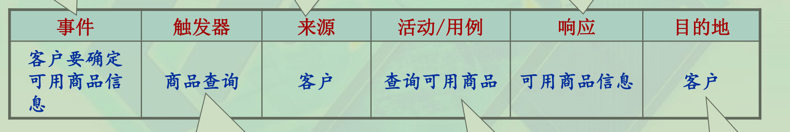

[事物]() 传统开发中`是构成系统存储信息的相关数据`(数据实体) 面向对象开发中`是在系统中相互交互的对象`(对象)  
  [事物的属性]() 有关事物的一条特定信息  
[实体关系图EntityRelationshipModel]()`ERD` 类IDEF1X图  
  [乌鸦脚]() 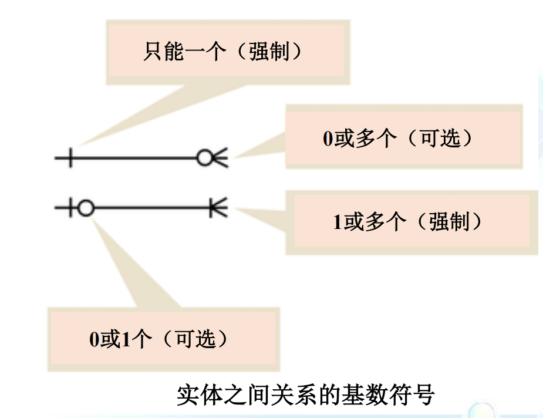   
[IDEF1X图]() IDEF是ICAM DEFinition method 的缩写,是美国空军在70年代末80年代初ICAM(Integrated Computer Aided Manufacturing)工程在结构化分析和设计方法基础上发展的一套系统分析和设计方法。是比较经典的系统分析理论与方法。
IDEF1X是IDEF系列方法中IDEF1的扩展版本,是在E-R(实体联系)法的原则基础上,增加了一些规则, 使语义更为丰富的一种方法。用于建立系统信息模型。

[类图]()  
* 抽象类
* 具体类
* 关联类

   [泛化/具体层次图]() 把类按照从最概括的父类到最具体的子类的顺序进行排列的层次图，有时也被称作`继承层次图`  

>相比于`聚合`(空心菱形)，`组成`(实心菱形)是对象与部分不可分割的关系。  

---
#  [用例图]()  

[用户故事Use Story]()  
 
好的用户故事应具备的特征：INVEST:Independent,Negotiable,Valuable,Estimatable,Small,Testable  

[用例Use Case]() 表示系统所提供的服务或可执行的某种行为，是actor与系统的交互  
  官方定义：一个用例定义了一组用例实例，其中每个实例都是系统所执行的一系列操作，这些操作生成特定主角可以观测的值
$$ 四大特征\left\{
\begin{array}{lcl}
行为序列(sequences of actions)\\
系统执行(system performs)\\
可观测到的、有价值的结果(observable result of value)\\
特定的角色(particular actor) 
\end{array} \right.$$  

$$ 用例\left\{
\begin{array}{lcl}
业务用例\\
概念用例\\
系统用例
\end{array} \right.$$
不能以步骤作为用例  
$$ 用例模型\left\{
\begin{array}{lcl}
参与者(Actor)\\
用例(Use Case)\\
通讯关联(Communication Association)
\end{array} \right.$$  
特殊的参与者：系统时钟:  
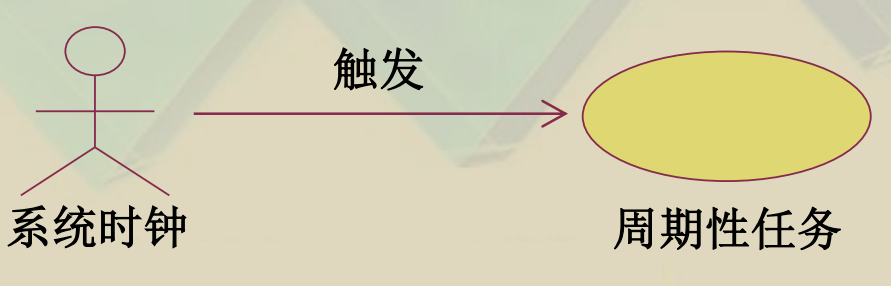  
[用例粒度]() 用例内涵的大小  
[边界]() 用例分析工作的范围(组织/系统/领域)  

[泛化(generalization)]() 用户共有的基用户 或 用例共有的基用例(空心三角形箭头指向基用户/基用例)   
[包含(include)]() 用例1会用到用例2(箭头属性<< include >>)   
[扩展(extend)]() 用例2在某些特定情况下会用到用例1(箭头属性<< extend >>)    
 
[泳道图swim-lane diagram]() 侧重于描述多个参与者的活动之间的交互关系  

---
#  [系统分析-结构化]() 
[结构化方法]()  面向过程，分析->设计->编程    
&emsp;&emsp;结构化、模块化、层次化  
[结构化分析方法(SA)]() 将待解决的问题看作一个系统，从而用系统科学的思想方法(抽象、分解、模块化)来分析和解决问题  
&emsp;&emsp;`核心思想:`自顶而下的分解(top-down)   
&emsp;&emsp;`定义`帮助开发人员定义系统需要做什么（处理需求），系统需要存储和使用哪些数据（数据需求），系统需要什么样的输入和  
&emsp;&emsp;输出以及如何把这些功能结合在一起来完成任务  
$$ 图\left\{
    \begin{array}{lcl}
    数据流图 DFD\\
    实体-关系图 ERD
\end{array} \right.$$ 

[DFD数据流图DataFlowDiagram]() 用处理、外部实体、数据流以及数据存储来表示系统需求的图表,可以逐步细化(关联、零层、一层...)  
&emsp;&emsp;要最小化复杂度，避免信息超量  
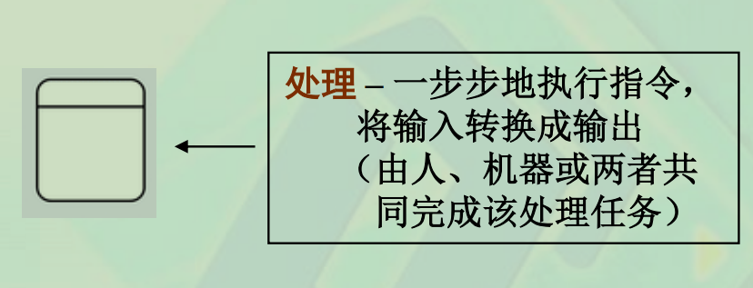
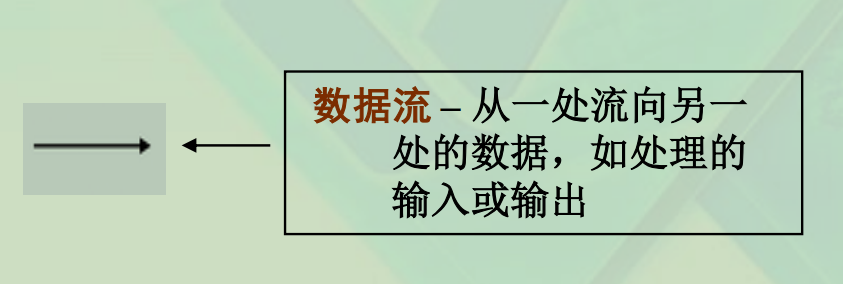
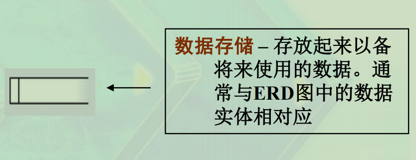
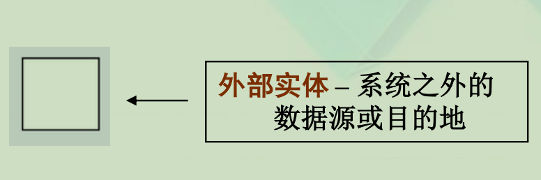
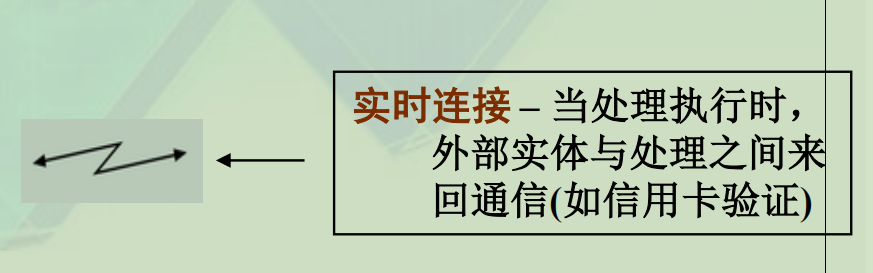
[关联图]() 在单个处理符号中概括系统内所有处理活动的DFD,数据存储不放在这里  
[零层图]() 将一个系统或子系统的所有DFD片段组合到一个单个的DFD图中，这样的DFD图称为事件分离的系统模型/0层图  
&emsp;&emsp;[黑洞]() 带有输入数据的但并不用其产生输出数据的处理或数据存储  
&emsp;&emsp;[奇迹]() 没有足够数据元素作为输入或产生来源的一个处理或数据存储  
[结构化语言]() 
* 使用短句
* 多层缩进
* 将结构化编程技术和叙述性语言结合
* 无确定语法
* 可分层、嵌套

[决策表]() “处理”逻辑的一种表格形式的表示方法，其中包括决策变量、决策变量值、行为或公式  
[决策树]() 用树形结构组织起来的线条对“处理”逻辑进行图形化的描述

[数据字典]() 是数据分析的描述模型，包括：数据项定义，数据结构定义，数据流描述，数据存储描述  

---
#  [系统分析-对象化]() 

$$ 图\left\{
    \begin{array}{lcl}
    用例图\\
    类图\\
    时序图\\
    协作图\\
    状态图
\end{array} \right.$$ 

$$ 分析模型\left\{
    \begin{array}{lcl}
    功能模型\\
    静态结构模型\\
    动态行为模型
\end{array} \right.$$ 

OOA`->`OOD`->`OOP`->`Testing

[分析类BCE]() 是概念层次上的内容，用于描述系统中较高层次的对象，直接与应用逻辑相关，而不关注于技术实现的问题   
   [边界类]() 表示参与者与系统之间的交互    
   [控制类]() 表示系统在运行过程中的业务控制逻辑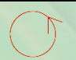  
  [实体类]() 表示系统存储和管理的持久性信息  

`~` 除非系统需要在各用例中管理和维护该角色的信息(不是指ID和密码)，否则只需将其作为actor，无需作为实体类(就是不需要存储这个角色的相关信息)  
  
[边界类、控制类分析]() UI、API;接收和发送的信息  
[实体类的属性分析]() 常识、问题域、系统责任、保存信息、为实现功能增设的属性、需要区分的状态、与其他实例的关系  

$$ 类之间的关系\left\{
    \begin{array}{lcl}
    泛化generalization\\
    关联association\\
    组合composition\\
    聚合aggregation\\
    依赖dependency
\end{array} \right.$$

[时序图]() 是强调时间顺序的交互图。将用户与分析类结合在一起，实现将用户的行为分配到所识别的分析类中  
&emsp;&emsp;纵轴是时间轴，时间沿竖线向下延伸；横轴代表了在协作中各独立的对象  
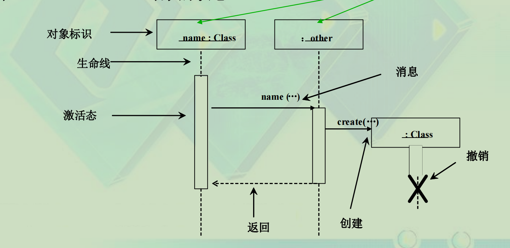

[消息]() 是对象之间某种形式的通信.它可以激发某个操作、唤起信号或导致目标对象的创建或撤销  
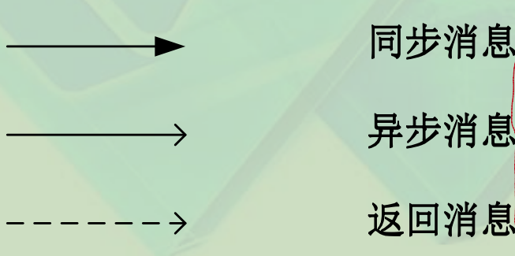

[时序图(顺序图)绘制]() 六种箭头:Create、Call、Return、Self-call、Send、Destroy  

---
#  [系统设计-结构化]()   
[自动化系统边界划分（Automation System Boundary）]()  

[结构图structure chart]() 以模块为基础、以模块间的调用为关联所构成的图称`模块结构图`，简称之  
  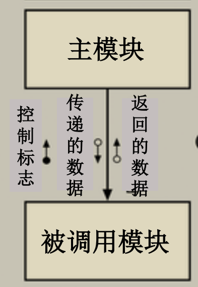 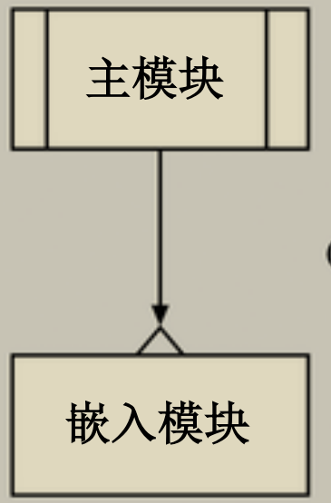 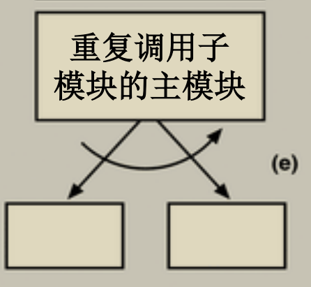 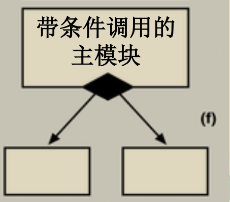

---
#  [系统设计-面向对象]() 
系统设计->对象设计->审评设计模型  

[包package]() 为了系统实现与维护过程中的方便性，将多个设计类按照彼此关联的紧密程度聚合到一起，形成大粒度的`包`  
包`->`子系统`->`系统  
[包图]() 是在 UML 中用类似于文件夹的符号表示的模型元素的组合  

[检查系统]() 正确性、一致性、完整性、可行性

[面向对象设计的基本步骤]() 
1. 创建初始的设计类
2. 细化属性
3. 细化操作
4. 定义状态
5. 细化依赖关系
6. 细化关联关系
7. 细化泛化关系  

[设计类图]() 更新分析阶段的类图，对各个类给出详细的设计说明  

[系统拓扑结构设计 -- 网络拓扑图]()  

[功能结构图]()  

---
# [数据库设计]()  

数据库系统=数据库(DB)＋数据库管理系统(DBMS)  

[关系型数据库管理系统]()将数据存储成表`table`和关系的结构  
数据库的表（Table）之间的关系通过Key Fields来建立  
– 主键（Primary Key）：本表中的关键属性  
– 外键（Foreign Key）：存储在本表中的其他表的关键属性，用来与其他表建立关联关系(相当于指针)  

[参照完整性]()  
&emsp;&emsp;当建立一个包含外键的记录时，DBMS 确保该外键同时作为主键出现在另一个相关表的记录中  
&emsp;&emsp;当删除一个记录时，DBMS 确保在其它相关的表中不会出现和该记录主键值相同的外键  
&emsp;&emsp;当主键值改变时，DBMS保证相关表中没有外键与该主键具有相同的值  

[对象关系映射（Object Relational Mapping，ORM）]()  

[ERD]()物理ERD需要数据类型，逻辑ERD不需要。

---
# [用户界面设计]()  

[缺省设计]()  
（1）经验值（固定常用值）作为缺省值；  
（2）学习得到动态缺省值；  
（3）最近输入内容作为缺省值；  
（4）用户设置缺省值；  
（5）输入数据的上下文关联缺省值；  

[输入验证设计]()  
&emsp;&emsp;[错误处理机制]()
1. 选择性确认(拦截性提示)  
2. 操作中断允许(在任务执行过程中有"取消"选项)
3. 回滚(在任务被中断的情况下回退到操作发生之前的状态)
4. Undo(随时可以回退到操作发生之前的状态)  

[系统响应及信息反馈]()

---
# [赞美]()  
减少输入数据量，或者减少操作过程、降低复杂性，提高数据输入或操作的效率，从而提高可用性，改善用户体验  