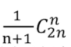

+++
title = '{{ markdown }}'
date = 2024-03-26T14:55:58+08:00
draft = false
+++

[超链接显示名](超链接地址 "超链接title")  
图片  
另一种图片   

一般用>的都是指随意移动位置，与上下文无关联的说明,~才是有关联的  

目录
* [标题](#title)
* [颜色](#color)

  树  `//定义的id不能有大写字母` 

 树的遍历  

---
标题
# 
 一级标题居中  
## 二级标题
#
各种字体  
**这是加粗的文字**  
*这是倾斜的文字*`  
***这是斜体加粗的文字***  
~~这是加删除线的文字~~  
<u>下划线</u>

>引用的内容  
列表和表格
- 列表内容
+ 列表内容
* 列表内容
1. 列表内容
2. 列表内容
3. 列表内容   

Name | Age
--------|------
|    Bob |27|
|  Alice | 23|  

| Italics   | Bold     | Code   |
| --------  | -------- | ------ |
| *italics* | **bold** | `code` |

---
字体颜色  

浅红色文字：浅红色文字：  
深红色文字：深红色文字  
浅绿色文字：浅绿色文字  
深绿色文字：深绿色文字  
浅蓝色文字：浅蓝色文字  
深蓝色文字：深蓝色文字  
浅黄色文字：浅黄色文字  
深黄色文字：深黄色文字  
浅青色文字：浅青色文字  
深青色文字：深青色文字  
浅紫色文字：浅紫色文字  
深紫色文字：深紫色文字  

---
size为1：size为1  
size为2：size为2  
size为3：size为3  
size为4：size为4  
size为10：size为10  

---
各种艺术字体  
我是黑体字  
我是宋体字  
我是微软雅黑字  
我是fantasy字  
我是Helvetica字  

---
背景色  
<table>
    <tr>
        <td bgcolor=#FF00FF>背景色的设置是按照十六进制颜色值：#7FFFD4</td>		</tr>
</table>
<table>
    <tr>
        <td bgcolor=#FF83FA>背景色的设置是按照十六进制颜色值：#FF83FA
        </td>
    </tr>
</table>
<table>
    <tr>
        <td bgcolor=#D1EEEE>背景色的设置是按照十六进制颜色值：#D1EEEE
        </td>
    </tr>
</table>
<table>
    <tr>
        <td bgcolor=#C0FF3E>背景色的设置是按照十六进制颜色值：#C0FF3E
        </td>
    </tr>
</table>
<table>
    <tr>
        <td bgcolor=#54FF9F>背景色的设置是按照十六进制颜色值：#54FF9F
        </td>
    </tr>
</table>
<table>
    <tr>
        <td bgcolor=DarkSeaGreen>这里的背景色是：DarkSeaGreen，此处输入任意想输入的内容
        </td>
    </tr>
</table>

---
空格  
例&ensp;是半角的空格，两个相当于一个中文宽度      
例&emsp;是全角的空格，占一个中文宽度  
例&nbsp;不换行空格，也是我们按下空格键产生的空格，不会累加    
例&thinsp;窄空格，一个中文字符的六分之一宽  

---
[多行大括号]() 
$$ 标题\left\{
\begin{array}{lcl}
一\\
二\\
\end{array} \right .$$
<pre>
		&#123;
			"foo": "bar",
			"baz": "qux"
		&#125;
	</pre>
$$
\textcolor{red}{\bigg\{} \quad \text{方程组内容} \quad \textcolor{red}{\bigg\}}
.$$

$$
\underbrace{\left\{ \quad \text{方程组内容} \quad \right.}_{\text{标签}}
.$$

$$\begin{cases}
\begin{aligned}
& ... \\
& ...
\end{aligned}
\end{cases}.$$