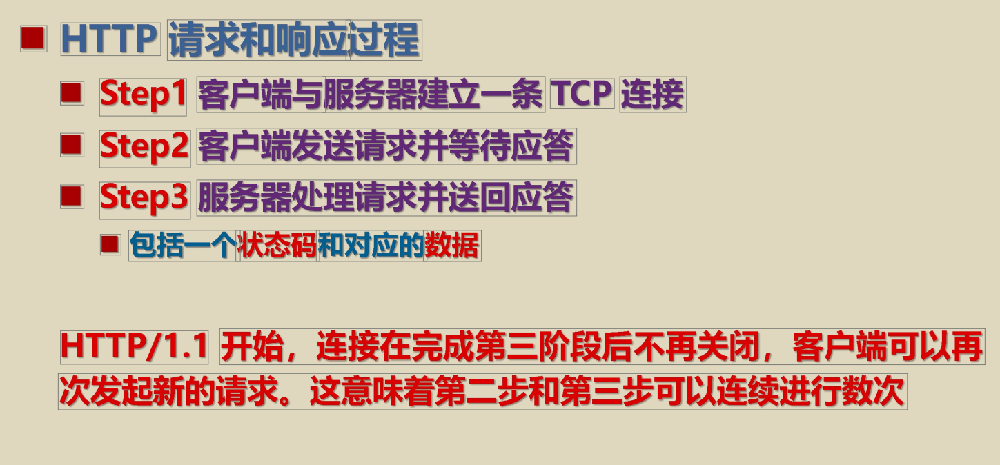
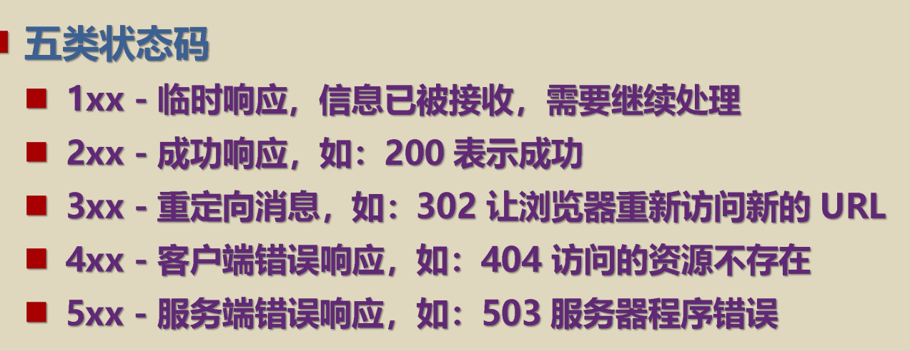
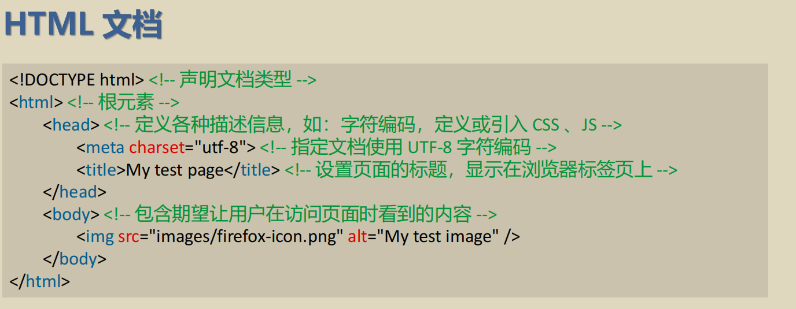
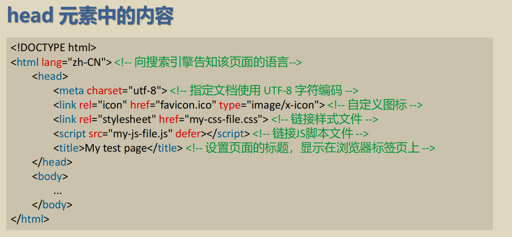
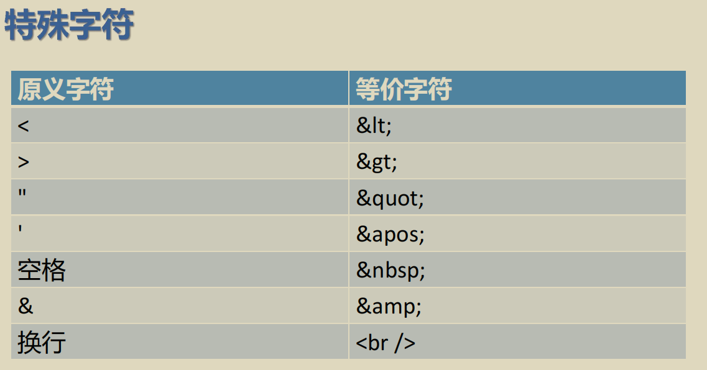
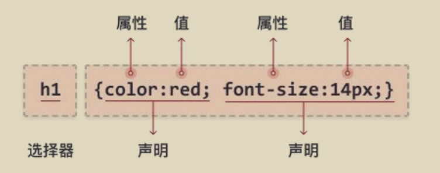
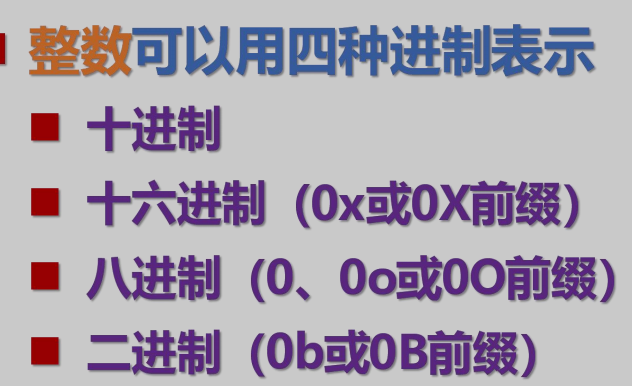

# [Front-end/Web 开发]()
 [CGI]() common gateway interface 公共网关接口
[script]() 脚本语言，是介于HTML和Java、C++和Visual Basic之类的编程语言之间的语言。
[javascript]() 是一种基于对象(Object)和事件驱动(Event Driven)并具有安全性能的脚本语言。
[pps]() precision positioning system网络吞吐率
[API]() application program interface应用程序界面

---
[网络搜索]()

[inurl:,intitle,intext]() 搜索功能值
[网站后缀]() `com`商业公司，`gov`政府机构，`edu`教育机构，`net`网络服务提供，`org`组织协会机构,`int`国际组织，`co`社区或公司，`info`信息服务提供，`mil`军事机构
[时间限制]() x..y从x年到y年
[指定网站搜索]() 关键词 site:网站网址

---
$$ 应用软件\left\{
\begin{array}{lcl}
单机软件(本地应用程序与本地服务端)\\
C/S结构(本地应用程序与服务器服务端)\\
B/S结构(浏览器访问)\\
\end{array} \right.$$
[胖客户端Fat client]() 是在本地安装了丰富资源的网络电脑，而不是像瘦客户端那样把资源分散到网络中。比如很多PC（个人电脑）就是胖客户端
[HTTP]() 用于传输超媒体文档(例如HTML)的应用层协议


动态网页技术:
* [PHP]() hypertext preprocessor
* [JSP]() Java Server Pages JavaEE的动态网页技术
* [ASP:Active Server Pages]() 微软公司windows平台动态网页技术
* [ASP.NET]() 微软.NET平台动态网页技术
* [Python]() Django
* [Node]() Express


[前端框架]()
* Angular
    * google
    * typescript
* React
    * facebook
    * javascript
* Vue
    * 尤雨溪

[后端框架]()
* Java Servlet
* SpringBoot
* Node Express
* PHP
* ASP.NET
* Python
* C++/Golang
*
[浏览器内核]()
* Trident IE内核
* Gecko Firefox内核
* Webkit Safari内核
* Blink Chrome内核

[DAO模式]() data Acess Object
## [HTML]() HyperText Markup Language超文本标记语言

document.write() 方法仅用于测试。
[子元素 后代元素]()
子元素是指一个元素内部的第一层子元素，也就是直接作为该元素子节点的元素。
后代元素是指一个元素内部包含的所有嵌套元素

[渲染Render]() 浏览器将HTML,CSS,JS展示在页面的过程称之
[嵌套元素]() 将一个元素置于其他元素之中
[空元素(自闭和标签)]() 不含任何内容的元素，如``
 <center> 
  
  

## [CSS]() 层叠样式表（Cascading Style Sheets
一种描述HTML(以及其他XML`extensible Markup Language`)文档样式的语言

[七种主要的CSS处理方式]()

css语法：


[选择器]()
* 元素
* id
* 类
* 通用 用`*`表示选择所有元素
* 分组 元素的合并分组 `,`
* 后代 `.`
* 子元素 `>`
* 相邻兄弟 `+`
* 兄弟 `~`

[使用CSS的方法]()
* 内部CSS 在`<head>`区用`<style>`标签定义
* 外部CSS 用`<link>`以外部文件方式引入
* 行内CSS 以`style=""`方式定义

[盒子模型]() 网页中的每个元素都可以看作一个盒子模型
[CSS布局]()
* 弹性布局`Flex Box`
* 网格布局`Grid`
* 响应式布局`自适应布局`
## [JavaScript]() 运行在浏览器中的Web前端脚本语言
[ECMAScript]()是标准，JS是ES的一种实现或方言
```
var x = new String();
var y = new Number();
var z = new Boolean();
```
字符串、数值或逻辑对象。他们会增加代码的复杂性并降低执行速度。
使用var声明的变量会提升`hoisting`,即在声明之前就可以使用
[小驼峰]() js推荐使用小驼峰命名变量
### [DOM]() `Document Object Model`  文档对象模型
[BOM]() `Browser Object Model` BOM包含DOM
#### [AJAX]() `Asynchronous Javascript And Xml` 不刷新页面更新网页
[get请求]()
```
const xhr = new XMLHttpRequest();
xhr.onreadystatechange = function() {
  if (xhr.readyState === 4 && xhr.status === 200) {
    console.log(xhr.responseText);
  }
};
xhr.open("GET", "https://example.com/data.json");
xhr.send();
```
[post请求]()
```
const xhr = new XMLHttpRequest();
xhr.onreadystatechange = function() {
  if (xhr.readyState === 4 && xhr.status === 200) {
    console.log(xhr.responseText);
  }
};
xhr.open("POST", "https://example.com/data");
xhr.setRequestHeader("Content-Type", "application/json");
xhr.send(JSON.stringify({key: "value"}));
```
#### [JSON]() `JavaScript Object Notation` 一种储存和交换数据的语法规范
并列的数据用`,`分割
映射用`:`表示
并列数据的集合(数组)用`[]`表示
映射的集合(对象)用`{}`表示
### [jQuery]() 最受欢迎的JavaScript库，是一套封装好的操作DOM的语法
### [**JS语法规则**]()
[数值]() 不分整数和浮点数，所有都是64位浮点，整数可精准15位，小数可精准17位
[对象构造器]() 可以创造类型相同的多个对象，利用`this`
ES6中使用类替换了它
[# 私有成员]()
[static 静态成员]()
[prototype]() 为对象构造器增加属性
[extends]()继承
[模块]() 一个js文件就是一个模块，`export`导出，`import`导入
[默认导出]()是匿名函数，关键字default
#### [异步操作]()
[async和await]()
[标志符]()以字母，下划线或美元符号开头
[定义变量和输出]()
```
var a =5;//非块作用域(全局变量)
{let b =2;}//b无法在这块作用域以外使用
let a =[];//数组
let f =function(){};//函数
let g ={};//对象
console.log(a);//输出a
```
[解构赋值]()
```
let[a,b] =[5,7];//let a =5,b =7;
```
[操作符]() 算数、关系、布尔、位、赋值
JS不区分整数和浮点数，所有数值都是64位，整数可精确15位，小数可精确17位

`${}` 反引号表示法，包含的字符串称为`模板字符串`
[类 class]() js中类是函数
`===`值等于且类型等于

# [node]()
是一个开源、跨平台的 JavaScript 运行时环境，它允许开发者使用 JavaScript 语言在服务器端构建高性能、可扩展的网络应用程序。

[函数式组件]() 首字母大写的js函数，函数返回虚拟DOM
[render]() 在Web开发中，"render"一般指将数据转化成HTML页面的过程。

# [Vue]()
[插值表达式 Interpolation Expression]()
允许将变量或表达式的值动态地嵌入到字符串中，以形成最终的字符串结果。
[el挂载点]() element mounting point
[nvm 的坑]()在你每次切换版本之后，必须切换 全局模块和全局缓存 的文件位置，不然你安装的全局库全都无法使用：# 比方说我切换到 18
`nvm use 18.14.0`
全局下载配置必须修改(配置到你安装 nvm 地址的地方)
`npm config set prefix D:\nvm\v18.14.0`
`npm config set cache D:\nvm\v18.14.0`
垃圾nvm,不能用
SCSS（Sassy CSS）是一种CSS预处理器，它扩展了普通CSS的功能，使得样式表更加模块化、易于维护和可重用。

[2024-03]() 原来`<router-view>`是`<router-link>`的占位符，我调了一天没想明白为什么`<router-link>`不管用，乐死了

 `RSS`全称是“Really Simple Syndication”（真正简易的聚合），是一种消息来源格式规范，用来发布经常更新的信息，如博客文章、新闻头条、音频、视频等。RSS使用户能够通过RSS阅读器或者聚合工具订阅网站，自动获取更新内容，而无需直接访问网站。这样，用户可以通过一个统一的界面浏览自己感兴趣的各种网站的最新内容。
RSS文件是基于XML（可扩展标记语言）的，包含了内容更新的标题、描述、发布日期和链接等信息。当网站内容更新时，RSS文件也会相应更新，订阅了该RSS源的用户能够通过他们的RSS阅读器看到新的内容和更新。